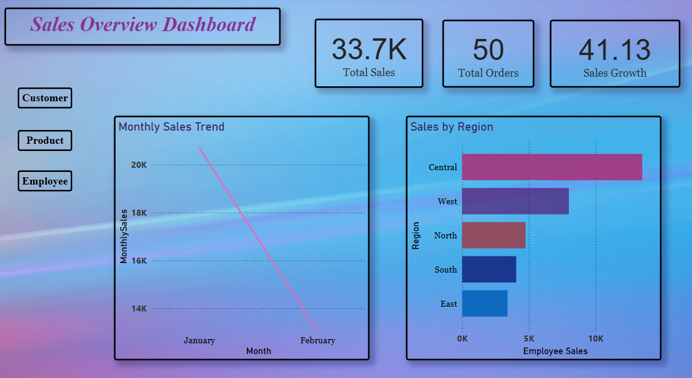
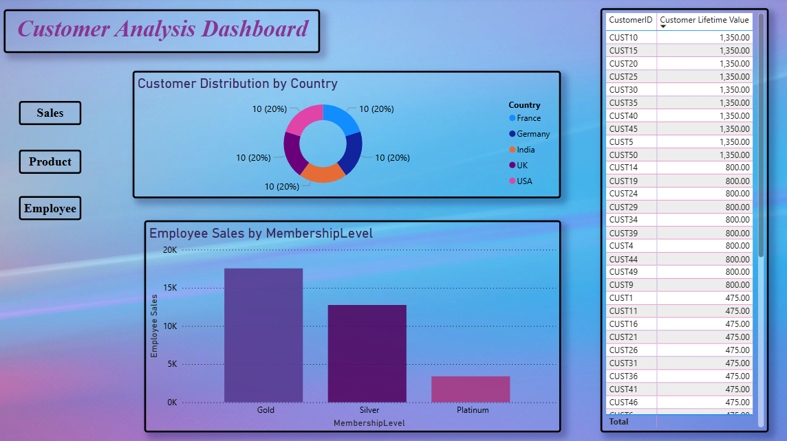
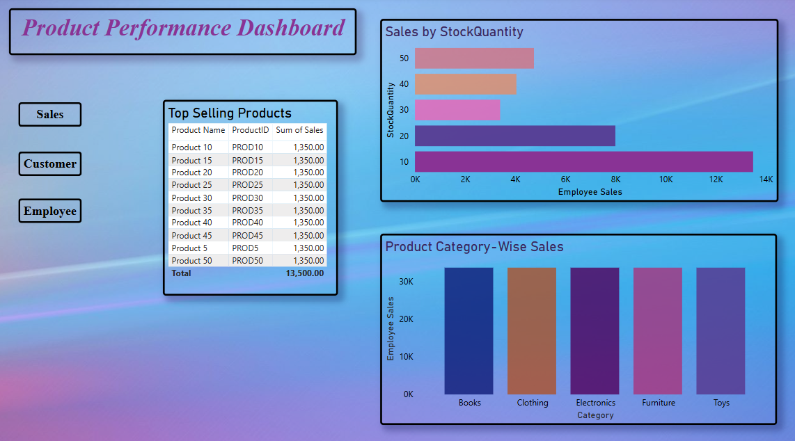
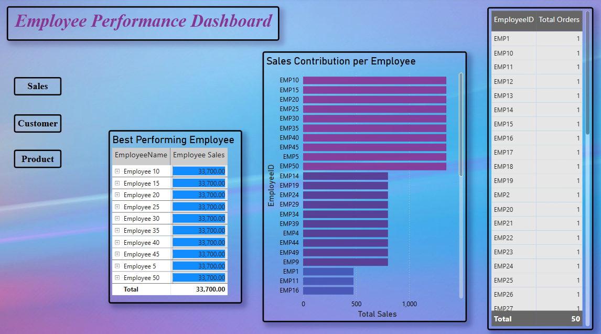

# 🚀 Interactive Sales Dashboards 📊  

I’m excited to share a comprehensive Power BI project that I recently worked on.  
This interactive dashboard suite offers a **360-degree view of business performance**, covering **Sales, Customer, Product, and Employee data**.  

---

## 📂 Files Included 
- `Dataset.xlsx` – Sample Dataset
- `Dashboard.pbix` – Power BI Dashboard File  
- `README.md` – Project documentation  
- `Sales_Dashboard.png` – Screenshot of Sales Dashboard  
- `Customer_Dashboard.png` – Screenshot of Customer Dashboard  
- `Product_Dashboard.png` – Screenshot of Product Dashboard  
- `Employee_Dashboard.png` – Screenshot of Employee Dashboard  

---

## 🔹 Dashboards  

### 1️⃣ Sales Overview  
  

- Total Sales: **33.7K 💰**  
- Sales Growth: **41.13% 📈**  
- Central region leads in sales.  
- Drop in sales from January to February.  

---

### 2️⃣ Customer Analysis  
  

- Balanced distribution across **France, Germany, India, UK, USA 🌎**  
- **Gold members = highest spenders**  
- Customer Lifetime Value (CLV) breakdown  

---

### 3️⃣ Product Performance  
  

- Top-selling products: **1,350 each**  
- Balanced category sales (**Books, Clothing, Electronics, Furniture, Toys**)  
- Stock quantity directly linked to sales  

---

### 4️⃣ Employee Performance  
  

- Uniform order distribution (**1 each**)  
- Top employees generate **33,700 each**  
- Sales contribution breakdown per employee  

---

## 📊 Key Features  
- Interactive navigation buttons  
- Clear visualizations of **trends & patterns**  
- Easy-to-understand **data-driven insights**  

---

## 🛠️ How to Use  
1. Download the `Dashboard.pbix` file.  
2. Open it in **Power BI Desktop**.  
3. Explore the interactive dashboards using the navigation buttons.  

---

📌 *Note: Dataset is a publicly available sample dataset, used only for practice and learning.*
